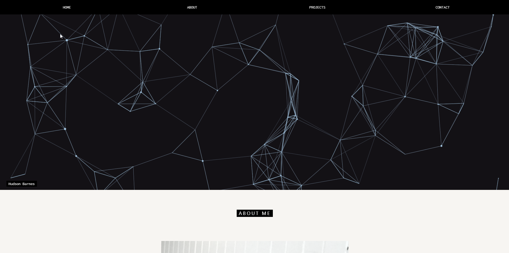

# Hudson Barnes's Portfolio
## Website Description

This is my updated portfolio website with active links to my resume, GitHub, and LinkedIn

## Getting Started

These instructions will get you a copy of the project up and running on your local machine for development and testing purposes. See deployment for notes on how to deploy the project on a live system.

### Prerequisites

What things you need to install the software and how to install them

```
Github and Gitlab accounts
GitBash or Terminal
```

### Installing

A step by step series of examples that tell you how to get a development env running

```
Clone the code to your terminal
Pull from the repository
View on Visual Studio Code
```

## Built With

* [HTML](https://developer.mozilla.org/en-US/docs/Web/HTML)
* [CSS](https://developer.mozilla.org/en-US/docs/Web/CSS)

## Deployed Link

* [See Live Site]()https://hudsonmbarnes.github.io/portfolio3/

## What I did



## Code Snippet

This part of the code is the the function to open the menu items

```
function openMenu(evt, menuName) {
  var i, x, tablinks;
  x = document.getElementsByClassName("menu");
  for (i = 0; i < x.length; i++) {
    x[i].style.display = "none";
  }
  tablinks = document.getElementsByClassName("tablink");
  for (i = 0; i < x.length; i++) {
    tablinks[i].className = tablinks[i].className.replace(" w3-dark-grey", "");
  }
  document.getElementById(menuName).style.display = "block";
  evt.currentTarget.firstElementChild.className += " w3-dark-grey";
}
document.getElementById("myLink").click();
```

## Editors

* **Hudson Barnes**
- [Link to Github](https://github.com/hudsonmbarnes)
- [Link to LinkedIn](https://www.linkedin.com/in/hudson-barnes-398483151/) 


## Authors

* **Hudson Barnes** 


## Acknowledgments

* W3schools.com
* stackoverflow.com
* google.com
* github.com